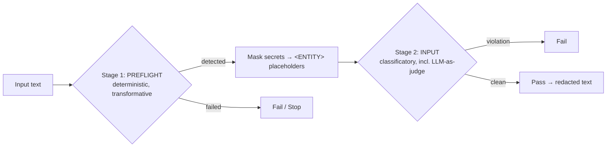

# Data Privacy & Content Security — Guardrails Research Docs

> Extracted design concept of the n8n **Guardrails** node, distilled into
> **reference theory** + a **worked implementation example**, to be reused to
> build a **Java library** (`data-privacy-guardrails`) for gating/sanitizing text
> before and after LLM calls.

---

## Why this exists

LLM applications need two kinds of protection: **data privacy** (don't leak PII,
secrets, credentials) and **content security** (don't accept prompt injection /
jailbreaks, NSFW, off-topic, unsafe URLs). The n8n Guardrails node solves both
with one composable policy engine. These docs extract that concept so it can be
rebuilt in Java and reused across projects.

## The concept in one diagram

---

## Document map

| Doc                                                                        | Content                                                                                                                                                                                                                                            | Read when                                                       |
| -------------------------------------------------------------------------- | -------------------------------------------------------------------------------------------------------------------------------------------------------------------------------------------------------------------------------------------------- | --------------------------------------------------------------- |
| [`docs/01-principle-and-theory.md`](docs/01-principle-and-theory.md)       | **The principle & reference theory** — OWASP/NIST grounding, deterministic vs LLM checks, staged pipeline, entropy secrets, entity DLP, SSRF, redaction, fail-safe semantics, uniform result contract. Each section has an extractable `TAKEWAY:`. | You want the _why_ / design invariants / standards to cite.     |
| [`docs/02-guardrails-node-example.md`](docs/02-guardrails-node-example.md) | **The n8n Guardrails node as a worked example** — exact files, contracts, and behavior that turn the theory into code (CheckFn factory, staged runner, each check, redactor, routing, extension recipe, observable behavior).                      | You want to _see_ how the theory maps to a real implementation. |
| [`docs/03-java-implementation.md`](docs/03-java-implementation.md)         | **Java library mapping** — core types, pipeline, redactor, per-check Java code sketches, LLM classifier seam, threading/failure policy, testing strategy, module layout, open questions.                                                           | You start the **next task: build the Java library**.            |
| [`design/data_privacy_core_design.md`](design/data_privacy_core_design.md) | **Resolved implementation design — ✅ implemented (v1)** — answers §11 (Spring AI default, `<ENTITY>` placeholders, full PII catalog, streaming, pure-logic compliance contract); repositions the library as a general data privacy & security library (pipelines, redact-before-logging, DLP), not LLM-only. | You start implementing and need the **decisions, guarantees, and module layout**. |

---

## v1 milestone — implemented

`data_privacy_core_design.md` is now **implemented** and accepted (v1 shipped). Two live modules:

| Module | Coordinate | Location | README |
| ------ | ---------- | -------- | ------ |
| **data-privacy-core** | `io.github.khezyapp:data-privacy-core:1.0.0` | `securities/data-privacy-core` | [`README.md`](../../securities/data-privacy-core/README.md) |
| **data-privacy-spring-ai** | `io.github.khezyapp:data-privacy-spring-ai:1.0.0` | `securities/data-privacy-spring-ai` | [`README.md`](../../securities/data-privacy-spring-ai/README.md) |

- **Execution plan:** `v1-actions/` — all 13 tasks marked complete in [`v1-actions/00-INDEX.md`](v1-actions/00-INDEX.md); the centralized handoff log [`v1-actions/00-HANDOFF.md`](v1-actions/00-HANDOFF.md) records everything (API surface, exact algorithms, deviations), with the final Task 13 entry carrying the guarantee→test mapping.
- **Acceptance:** `GuaranteeScopeTest` (`data-privacy-core`) covers every design §3 guarantee/non-guarantee (G1–G7 + N1–N5 + one cross-family end-to-end test); `EndToEndSpringAiTest` (`data-privacy-spring-ai`) proves the jailbreak family surfaces through `Guardrails` with a stubbed `ChatClient`. Both modules build fully green (`./gradlew :data-privacy-core:build` and `./gradlew :data-privacy-spring-ai:build`).

---

## How to use these docs

### For humans

1. Skim this README for the map.
2. Read **01** for the theory (each section has a `> TAKEWAY:` — the invariants
   you must preserve).
3. Cross-check with **02** whenever you wonder "how would this actually look?"
4. Use **03** as the starting skeleton for the Java implementation task.

### For agents (copilot / coding agents)

If you are an agent asked to **"build the Java guardrails library"** (or similar)
for `khezy-kit`, do this:

1. Read `docs/01-principle-and-theory.md` → extract all `TAKEWAY:` lines; these
   are the **non-negotiable invariants**.
2. Read `docs/02-guardrails-node-example.md` → use the "observable behavior
   contract" (section 9) and "extension recipe" (section 10) as the spec to
   replicate in Java.
3. Read `docs/03-java-implementation.md` → start from the types and module layout;
   resolve the "open questions" in section 11 before/while coding (ask the user
   if needed).
4. Preserve these invariants in the Java port:
   - uniform `GuardrailResult` shape (`name`, `triggered`, `confidenceScore`,
     `executionFailed`, `maskEntities`);
   - two-stage pipeline (transform first, then classify on **masked** text);
   - `triggered = flagged && confidenceScore >= threshold` for LLM checks;
   - **fail-safe**: errored check ≠ pass; sanitize fails closed;
   - redaction is literal, longest-match-first, `<ENTITY>` placeholders.
5. Do NOT copy n8n code verbatim; re-implement from the contracts. n8n is MIT;
   the PII/URL/keyword checks are derived from OpenAI Guardrails JS (MIT) — keep
   the attribution notes if you port regex tables.

### For the Java next-task handoff
The next task is: **"Implement `io.github.khezyapp:data-privacy-core` (+ the
`data-privacy-spring-ai` adapter) in `/mnt/data/khezylib/khezy-kit` using
`docs/03-java-implementation.md` as the contract and
`design/data_privacy_core_design.md` as the resolved decisions."** Hand the
agent the three docs in order plus the invariant list below and the design doc
(§1 decisions, §3 guarantee scope).

---

## Glossary

| Term                                | Meaning                                                                                                   |
| ----------------------------------- | --------------------------------------------------------------------------------------------------------- |
| **Guardrail / Check**               | A named predicate `text → GuardrailResult`.                                                               |
| **Tripwire**                        | A check that "fires": `tripwireTriggered = true`. For LLM checks: `flagged && confidence >= threshold`.   |
| **Deterministic check**             | Rule-based (regex/entropy/allowlist), no model. Cheap, explainable.                                       |
| **LLM-as-judge / classifier check** | A model classifies the input; returns `{confidenceScore, flagged}` under a strict JSON schema.            |
| **Preflight stage**                 | Transformative checks (PII, customRegex, secretKeys, urls). Detect & produce `maskEntities`.              |
| **Input stage**                     | Classificatory checks (keywords, jailbreak, nsfw, topicalAlignment, custom). Run on **masked** text.      |
| **Mask / Redact**                   | Replace sensitive tokens with typed `<ENTITY>` placeholders (literal, longest-first).                     |
| **Threshold**                       | Decision boundary for model checks; precision/recall dial.                                                |
| **executionFailed**                 | The check errored — distinct from "passed". Fail-safe semantics.                                          |
| **Classify vs Sanitize**            | `classify` = gate (Pass/Fail streams); `sanitize` = transform (redacted text out, fail-closed on errors). |

---

## Source & attribution

- Reference implementation: **n8n** — `packages/@n8n/nodes-langchain/nodes/Guardrails/`
  (MIT, https://github.com/n8n-io/n8n).
- PII / URL / keyword checks derived from **OpenAI Guardrails JS** (MIT,
  https://github.com/openai/openai-guardrails-js) — see `CREDIT.MD` in the n8n
  source.
- Standards: OWASP GenAI Security Project / LLM Top 10 (2026), NIST AI RMF +
  GenAI Profile, OWASP SSRF Prevention Cheat Sheet.
- n8n docs: https://docs.n8n.io/integrations/builtin/core-nodes/n8n-nodes-langchain.guardrails/

_Last updated: 2026-08-29 (v1 shipped).
