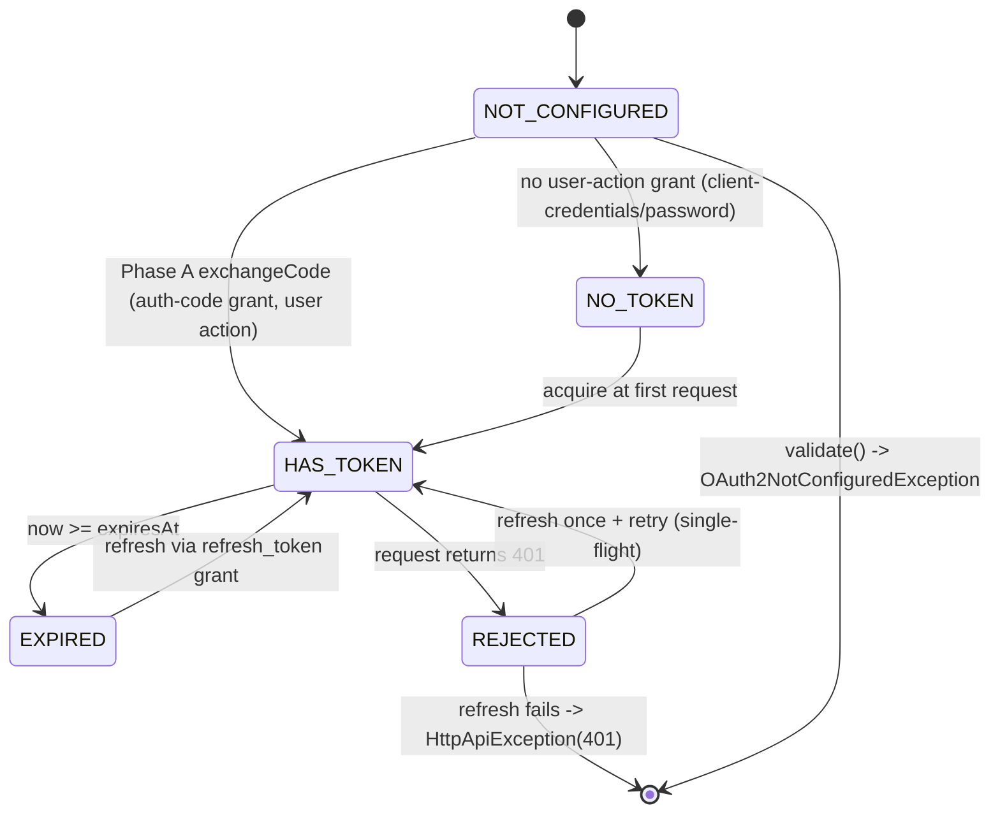

# Declarative HTTP — Java Core Library Principle Design (v2)

## Scope

This document specifies the **principle design** for a reusable Java core library that ports the essence of n8n's declarative HTTP engine (`routing-node.ts` + `IHttpRequestOptions` + `DeclarableRestApiSettings` + the credential/auth pipeline) into the Java ecosystem, as a standalone, framework-agnostic library.

The research (`research/n8n_declarative_http_research.md`) extracted 16 user requirements (R1–R16) from n8n's real-world node usage. **This design shows how a Java core library satisfies them.**

**Package root:** `io.github.khezyapp.dhttp` (mirrors the repo convention `io.github.khezyapp.*`).

**Module:** `http/declarative-http` — a composite-build member already scaffolded in this repo.

**Goal:** Any Java project — a Spring service, a Quarkus integration, a plain JDK app — can declare "how to talk to a REST API" as **configuration/annotations/data**, and the core library turns that into executed requests with automatic auth (including OAuth2 token lifecycle), pagination, response shaping, and security — no imperative HTTP glue.

### Redefinitions vs v1 (this revision)

| Area | v1 | v2 (this design) |
| --- | --- | --- |
| Expression engine | SpEL (planned default) | **JEXL** (`commons-jexl3:3.7.0`, already declared in `http/declarative-http/build.gradle`) |
| Dot-notation access | hand-rolled path parser | **`dynamic-object`** (`io.github.khezyapp.doa.DynamicObjects`), the existing KHEZY core library |
| OAuth2 support | single `OAuth2Flow` SPI stub | **two-phase config** — (A) configure the credential with its user-action authorization flow, (B) configure the HTTP spec with credential references + config-time validation; **request-time lifecycle** — acquire, persistent token store, refresh-on-expiry, refresh-on-401 with single-flight |
| Credential management | `CredentialStore.resolve` stub only | **unified config API** — `CredentialService` CRUD by type (Map + type-safe overloads), abstract `CredentialRepository` (in-memory default), encrypted-at-rest `StoredCredential` via pluggable `CredentialCipher` with consumer-owned key, Jackson 3 `JsonMapper` |

---

## 1. Design Principles

1. **Declarative over imperative.** Developers describe _what_ an API interaction looks like; the engine decides _how_ to execute it. Request code lives once in the library, not in each integration.
2. **Spec ⇄ Engine ⇄ Transport, strictly separated.** A _spec_ is immutable data (records). The _engine_ is a pure function `(spec, context) → request plan → execute → records`. The _transport_ is a pluggable SPI. No layer reaches into another.
3. **Single request-planning core, two modes.** The same planner serves **execution** (run an operation over a data item) and **metadata/design-time** (fetch options for autocomplete/validation) — mirroring n8n's `loadOptions`/`listSearch` reuse (R15).
4. **Per-item context.** All expression evaluation and all request building happen per input record, because values depend on the current item (n8n's `$parameter`/`$json`/`$item` per-item semantics, R5).
5. **Secure by default.** SSRF guards, domain allow-lists, credential stripping on cross-origin redirects, and secret redaction in logs are part of the core, not add-ons (R12).
6. **Reuse KHEZY core, don't reinvent.** Expressions run on **JEXL**; object-graph dot-notation navigation runs on the existing **`dynamic-object`** library. Everything Java-y else (JSON mapper, HTTP client, credential store, pagination strategy) is a pluggable SPI with sensible defaults (R5, R10).
7. **Stateless engine, explicit context.** The engine holds no mutable state; concurrency comes from callers creating per-call `RequestContext`. Easy to unit test (R16). The only deliberately stateful components are the **OAuth2 token store** and **authorization-flow state**, both isolated behind SPIs.
8. **Deterministic pipeline.** A fixed, documented execution order: precondition filtering → fragment merge → expression resolution → pre-send → auth → transport → post-receive → capping → records. Tests assert the exact plan and output.

---

## 2. Package Structure

```
io.github.khezyapp.dhttp/
├── spec/                       # Immutable declarative model (the "description" DSL)
│   ├── HttpRequestSpec.java    #   root spec: baseUrl, defaultHeaders, defaultTimeout, ...
│   ├── Operation.java          #   one API operation: method, path, sends, outputs, pagination
│   ├── Route.java              #   a declarative fragment (request / send / output / operations)
│   ├── Send.java               #   parameter→request mapping (body|query, dotNotation, valueOverride)
│   ├── Output.java             #   maxResults + PostReceive actions
│   ├── PostReceive.java        #   action descriptors (rootProperty, filter, limit, set, ...)
│   ├── PreSend.java            #   pre-send hook descriptor
│   ├── PaginationSpec.java     #   offset | cursor | custom
│   └── Condition.java          #   display/activation precondition (R3)
│
├── plan/                       # The request-planning engine (runtime accumulation)
│   ├── RequestPlanner.java     #   spec + context → RequestPlan  (pure)
│   ├── RequestPlan.java        #   resolved HttpRequest + pipeline refs
│   ├── RequestContext.java     #   per-item context: record, params, credentials, variables
│   ├── FragmentMerger.java     #   deep-merge of Route fragments (R2)
│   └── ConditionEvaluator.java #   precondition gating (R3)
│
├── engine/                     # Execution
│   ├── DeclarativeHttpEngine.java #   orchestrates the pipeline
│   ├── Pipeline.java           #   preSend → auth → transport → postReceive
│   ├── HttpResult.java         #   body/status/headers (full response mode, R11)
│   ├── OutputRecord.java       #   json / binary / metadata output item
│   ├── OptionItem.java         #   name, value, description, icon, group, disabled (R15)
│   └── OptionPage.java         #   items + hasMore + nextCursor (R15 paging state)
│
├── action/                     # Pre/Post processors
│   ├── PreSendAction.java          #   @FunctionalInterface: HttpRequest → HttpRequest
│   ├── PostReceiveAction.java      #   @FunctionalInterface: (records, response) → records
│   ├── builtin/
│   │   ├── RootProperty.java       #   uses DynamicObjects.get(body, property)  (R4)
│   │   ├── FilterItems.java
│   │   ├── LimitItems.java
│   │   ├── SetValue.java           #   uses DynamicObjects.set(...)
│   │   ├── SortByKey.java
│   │   ├── SetKeyValue.java        #   uses DynamicObjects.set(...)
│   │   └── BinaryData.java
│   └── ActionRegistry.java     #   name → factory mapping
│
├── auth/                       # Credential & authentication SPI
│   ├── CredentialStore.java    #   engine read-side SPI: resolve by type/id (§6.2)
│   ├── Authenticator.java      #   inject auth into HttpRequest
│   ├── GenericAuthenticator.java   #   header/query/basic from credential fields (R10)
│   ├── credential/             #   unified credential configuration & management (§6.2)
│   │   ├── CredentialService.java          #   CRUD by type (Map + type-safe overloads); common logic
│   │   ├── CredentialRepository.java       #   abstract persistence SPI
│   │   ├── InMemoryCredentialRepository.java #  default in-memory impl
│   │   ├── StoredCredential.java           #   id, type, data (encrypted Map), timestamps
│   │   ├── DecryptedCredential.java        #   decrypted fields + type-safe view
│   │   ├── CredentialSummary.java          #   id + type only (list, never secrets)
│   │   ├── CredentialCipher.java           #   encryption SPI (Map ↔ EncryptedPayload)
│   │   ├── AesGcmCredentialCipher.java     #   default (JDK AES-256-GCM)
│   │   ├── KeyProvider.java                #   consumer-supplied master key (the security)
│   │   ├── CredentialType.java             #   marker: type name + Class<T>
│   │   └── type/                           #   typed config records (JsonMapper ↔ Map)
│   │       ├── OAuth2Credentials.java      #   oauth2
│   │       ├── HeaderApiKeyCredentials.java #  api-key
│   │       ├── BasicAuthCredentials.java   #   basic-auth
│   │       └── HttpHeaderCredentials.java  #   http-header
│   ├── oauth2/                 #   OAuth2 — two-phase: config (user action) + request lifecycle (§6.6)
│   │   ├── OAuth2AuthorizationFlow.java   #   CONFIG-time: authorizationUrl → exchangeCode → persist → validate
│   │   ├── OAuth2RequestAuthenticator.java #  REQUEST-time: tokenFor → inject → refresh → retry-on-401
│   │   ├── OAuth2Grant.java        #   AUTHORIZATION_CODE | CLIENT_CREDENTIALS | PASSWORD | REFRESH_TOKEN
│   │   ├── TokenStore.java         #   SPI: persist/load access_token, refresh_token, expiresAt
│   │   ├── OAuth2Token.java        #   immutable token record (+ expiry)
│   │   └── OAuth2TokenClient.java  #   raw token endpoint calls (JEXL-free, transport reuse)
│   └── AuthResult.java
│
├── expr/                       # Expression SPI (R5) — JEXL + dynamic-object
│   ├── ExpressionEvaluator.java    #   interface
│   ├── EvaluationScope.java        #   bindings: $credentials, $parameter, $response, ...
│   ├── jexl/JexlExpressionEvaluator.java  #   default impl (commons-jexl3)
│   ├── jexl/JexlEngineFactory.java        #   cached JexlEngine + namespace registration
│   └── DoaNamespace.java         #   exposes DynamicObjects as `doa.*` in JEXL expressions
│
├── transport/                  # HTTP transport SPI (R11)
│   ├── HttpTransport.java      #   send(HttpRequest) → HttpResult
│   ├── HttpRequest.java        #   transport-neutral request value object
│   ├── HttpRequestBuilder.java
│   ├── Body.java               #   sealed: JsonBody | FormBody | RawBody | BinaryBody | NoBody
│   ├── jdk/JdkHttpTransport.java        #   default (Java HttpClient)
│   └── okhttp/OkHttpTransport.java      #   optional adapter
│
├── security/                   # Security-first behaviors (R12)
│   ├── SsrfGuard.java          #   URL + DNS allow/deny validation
│   ├── RedirectPolicy.java     #   cross-origin credential stripping
│   ├── DomainAllowList.java
│   └── SecretRedactor.java     #   redact auth/headers in logs
│
├── pagination/                 # R9
│   ├── PaginationStrategy.java     #   interface
│   ├── OffsetPagination.java
│   ├── CursorPagination.java
│   └── PaginationContext.java      #   plan, current response, continue-eval
│
├── error/                      # R13
│   ├── HttpApiException.java   #   structured: status, operation, itemIndex, cause
│   ├── HttpErrorFactory.java
│   └── OAuth2NotConfiguredException.java  #   config-time: credential has no valid access token (§6.6)
│
├── json/                       # JSON / object-mapper SPI (Map ↔ typed)
│   ├── JsonMapper.java         #   toMap / fromMap / write / read
│   └── jackson3/JacksonJsonMapper.java  #   default impl (tools.jackson:jackson-databind:3.2.1)
│
└── config/
    ├── DeclarativeHttpConfig.java  #   assembled config: mapper, transport, evaluator, tokenStore, credentialService, ...
    └── DeclarativeHttp.java        #   entry point / builder facade (engine + validate)
```

---

## 3. Core Abstractions — Java API Sketch

### 3.1 The spec model (declarative, immutable)

```java
// Root spec — the "node description"
public record HttpRequestSpec(
    String baseUrl,                      // may be templated/expression (R1, R5)
    Map<String, String> defaultHeaders,  // merged under operation headers (R2)
    long defaultTimeoutMillis,
    boolean defaultSkipSsl,              // R11
    List<Operation> operations,
    CredentialRef defaultCredential,     // R10
    PaginationSpec defaultPagination,    // R9
    SecurityPolicy security              // R12
) {}

// One operation — "resource + operation"
public record Operation(
    String id,                           // e.g. "contact.create"
    List<Condition> when,                // preconditions / displayOptions (R3)
    Route route                          // request shape + send + output + operations
) {}

// A declarative fragment
public record Route(
    RequestShape request,                // method, path, headers, query, json, encoding...
    List<Send> sends,                    // parameter → request mapping (R4)
    Output output,                       // maxResults + postReceive (R7, R8)
    PaginationSpec pagination,           // R9
    List<PreSend> preSends               // R6
) {}

// Parameter → request mapping
public record Send(
    String fromParam,                    // source field
    Target target,                       // BODY | QUERY
    String property,                     // target key or dot-notation path
    boolean dotNotation,                 // R4 — resolved via DynamicObjects.get(fromParam, property)
    Expression valueOverride             // optional constant/expression instead of param value
) {}

public record Output(
    int maxResults,                      // R8
    List<PostReceive> postReceive        // R7
) {}

public sealed interface PostReceive
    permits RootProperty, FilterItems, LimitItems,
            SetValue, SortByKey, SetKeyValue, BinaryData, CustomPostReceive {
  record RootProperty(String property) {}       // DynamicObjects.get(body, property)
  record FilterItems(Expression pass) {}
  record LimitItems(int max) {}
  record SetValue(Expression value) {}
  record SortByKey(String key, boolean desc) {}
  record SetKeyValue(Map<String, Expression> fields) {}  // DynamicObjects.set per key
  record BinaryData(String destinationProperty) {}
  record CustomPostReceive(String actionKey, Map<String,Object> props) {}
}
```

> **Design decision:** sealed types + a small `ActionRegistry` keeps built-ins discoverable while allowing custom actions — matching n8n's `type`-switch plus function form of `PostReceiveAction`.
>
> **Design decision (dot-notation):** every place a string path names a location in a nested object (`Send.property` when `dotNotation`, `RootProperty.property`, `SetKeyValue` keys, `PaginationSpec.rootProperty`) resolves through **`DynamicObjects`** from `dynamic-object`. The library never hand-rolls path parsing.

### 3.2 The plan & context (per-item runtime)

```java
// Immutable per-item bindings the expression evaluator resolves against (R5)
public record RequestContext(
    String operationId,
    OutputRecord item,                   // current input record
    Map<String,Object> parameters,       // resolved node/operation params
    Map<String,Object> credentials,      // decrypted credential fields (R10)
    Map<String,Object> variables,        // env/instance vars
    Consumer<HttpResult> onResponse      // optional callback to feed $response
) {}

// Output of the planner — a fully resolved request + pipeline (R16)
public record RequestPlan(
    HttpRequest request,                 // transport-neutral resolved request
    List<PreSendAction> preSends,        // R6
    List<PostReceiveStep> postReceives,  // R7
    PaginationStrategy pagination,       // R9
    int maxResults,                      // R8
    AuthRequest authRequest              // what credential + how (R10)
) {}
```

### 3.3 The engine (pure, deterministic)

```java
public final class DeclarativeHttpEngine {
    public void validate(HttpRequestSpec spec) {
        // config-time: resolve defaultCredential/operation credential refs
        //   OAuth2 → OAuth2AuthorizationFlow.validate()
        //   no valid access token ⇒ throw OAuth2NotConfiguredException (config not yet valid)
    }

    public List<OutputRecord> execute(HttpRequestSpec spec, RequestContext ctx) {
        // 1. select the active Operation by preconditions (R3)
        // 2. RequestPlanner.plan(spec, operation, ctx) -> RequestPlan   (pure, R16)
        // 3. run Pipeline: preSends -> authenticator -> transport -> postReceives
        //    (paginate if strategy present) (R6,R7,R9,R11)
        // 4. cap by maxResults (R8); wrap errors (R13); respect continueOnError
    }

    public OptionPage describe(HttpRequestSpec spec, RequestContext ctx, String loadKey) {
        // metadata/design-time mode: same planner, option-shaping postReceive (R15)
        //   → OptionPage(items, hasMore, nextCursor): paging state driven by the action's
        //     OutputRecord.metadata keys "hasMore" (truthy) / "nextCursor"
    }
}
```

> **Design decision (OptionPage):** `describe(...)` returns a page, not a bare list. The
> option-shaping action — which already reads the full API response — stamps paging state onto each
> `OutputRecord.metadata` (`hasMore`, optional `nextCursor`); the engine aggregates it into
> `OptionPage(List<OptionItem> items, boolean hasMore, String nextCursor)`. When the action sets
> neither, `hasMore` is `false` and `nextCursor` is `null`, so searchable/paginated dropdowns render
> "load more" without the engine guessing page boundaries.

### 3.4 Transport-neutral request value object

```java
// Mirror of IHttpRequestOptions (R11), framework-agnostic
public final class HttpRequest {
    public static HttpRequestBuilder builder();
    // url, baseUrl, method, headers (case-insensitive, multi-value)
    // query: Map + ArrayFormat (INDICES|BRACKETS|REPEAT|COMMA)
    // body: sealed Body — JsonBody | FormBody(Map<String,?> w/ FilePart) |
    //                      UrlEncodedBody(Map<String,?>) | RawBody |
    //                      BinaryBody (octet-stream default) | NoBody
    // auth: basic/digest/bearer; sendImmediately flag
    // proxy, timeout, skipSsl, maxRedirects, disableFollowRedirect
    // encoding, jsonAccept, ignoreStatusErrors(except[]), abortSignal, allowedDomains
}
```

---

## 4. The Execution Pipeline

```mermaid
flowchart LR
    A[HttpRequestSpec + RequestContext] --> B[Select active Operation<br/>via preconditions]
    B --> C[RequestPlanner.plan<br/>merge requestDefaults + route fragments<br/>resolve JEXL expressions per item<br/>resolve dot-paths via DynamicObjects]
    C --> D[RequestPlan]
    D --> E[preSend hooks]
    E --> F{Auth?}
    F -->|oauth2 credential| G[OAuth2RequestAuthenticator<br/>inject Bearer<br/>refresh-on-expiry / 401 retry]
    F -->|generic credential| G2[GenericAuthenticator<br/>header/query/basic]
    F -->|none| H[Transport.send]
    G --> H
    G2 --> H
    H --> I{Return full response?}
    I -->|yes| J[HttpResult body/status/headers]
    I -->|no| K[body passthrough]
    J --> L[postReceive actions<br/>rootProperty/filter/limit/set/sort/setKeyValue/binaryData/custom<br/>paths via DynamicObjects]
    K --> L
    L --> M{maxResults?}
    M -->|yes| N[cap]
    M -->|no| O[OutputRecord list]
    N --> O
    H -.pagination.-> P[PaginationStrategy<br/>offset / cursor / custom]
    P -.loop.- H
    H -.OAuth2 401.-> G
```



---

## 5. Requirements → Design Mapping

| Req | Requirement (from research)                  | Design element                                                   |
| --- | -------------------------------------------- | ---------------------------------------------------------------- |
| R1  | Declarative description, no imperative HTTP  | `HttpRequestSpec` / `Operation` / `Route` records (§3.1)         |
| R2  | Defaults merged with per-operation overrides | `FragmentMerger` deep-merge (§2, §3.1)                           |
| R3  | Conditional routing by state                 | `Condition` + `ConditionEvaluator`, selection step (§3.3)        |
| R4  | Parameter → request mapping                  | `Send` (BODY/QUERY, `dotNotation` via `DynamicObjects`, valueOverride) (§3.1) |
| R5  | Per-request expression evaluation            | `ExpressionEvaluator` SPI; **JEXL default** (`commons-jexl3`); `DoaNamespace` for `DynamicObjects` (§2, §6.1) |
| R6  | Pre-send transformation hooks                | `PreSendAction` + `PreSend` descriptors (§2, §3.2)               |
| R7  | Post-receive response shaping                | `PostReceive` sealed actions + custom (§3.1)                     |
| R8  | Output capping                               | `Output.maxResults` + engine cap step (§3.1, §3.3)               |
| R9  | Pagination (offset/cursor/custom)            | `PaginationStrategy` + built-ins (§2)                            |
| R10 | Credential abstraction & auth injection      | `CredentialStore` (engine) + `CredentialService`/`CredentialRepository` (config CRUD) + `CredentialCipher`/`KeyProvider` (at-rest) + `OAuth2AuthorizationFlow` (config) + `OAuth2RequestAuthenticator` + `TokenStore` (request); `engine.validate` config-time check (§2, §6.2, §6.6) |
| R11 | Rich transport contract                      | `HttpRequest` value object + `HttpTransport` SPI (§3.4)          |
| R12 | Security-first defaults                      | `SsrfGuard`, `RedirectPolicy`, `SecretRedactor` (§2)             |
| R13 | Structured error model                       | `HttpApiException` + `HttpErrorFactory` (§2)                     |
| R14 | Cancellation & lifecycle, binary/streaming   | `abortSignal`, BINARY body, `HttpResult` streaming (§3.4)        |
| R15 | Metadata/design-time mode                    | `DeclarativeHttpEngine.describe(...)` → `OptionPage`; `OptionItem` presentation fields (name, value, description, icon, group, disabled); paging via `OutputRecord.metadata` (§3.3) |
| R16 | Deterministic, testable engine               | pure `RequestPlanner` + injected fake transport (§3.3)           |

---

## 6. SPI Details (what implementers extend)

### 6.1 `ExpressionEvaluator` — JEXL default

```java
public interface ExpressionEvaluator {
    /** true if the value is an expression (e.g. starts with "=" or is a template). */
    boolean isExpression(String value);
    /** resolve against the per-item scope. */
    <T> T evaluate(String expression, EvaluationScope scope, Class<T> type);
}
```

n8n uses `={{...}}` templates. The core **defaults to JEXL** (`org.apache.commons:commons-jexl3`):

- Strings starting with `=` are evaluated as **JEXL expressions** (e.g. `={{ $credentials.baseUrl.replace('api','rest') }}` → `=` + JEXL `$credentials.baseUrl.replace('api','rest')`).
- `{{...}}` template interpolation is handled by **Handlebars** (`com.github.jknack:handlebars`), already declared in the module.
- The JEXL engine is created once per config via `JexlEngineFactory` (expression **namespaces** registered there) and cached for throughput (R5).

**Binding the KHEZY `dynamic-object` library into expressions.** JEXL namespaces let us expose object-graph navigation directly in expressions. `JexlEngineFactory` registers a namespace so both of these are legal in one expression string:

```java
// expression:  doa.get($response, "data.items[0].id")
JexlEngine engine = JexlEngineFactory.cached(scope -> scope
    .namespace("doa", new DoaNamespace(DynamicObjects.OBJECT_ACCESSOR)) // dynamic-object bridge
    // $credentials, $parameter, $response, $responseItem, $value, $env, $item, $index, $parent
    .bind("$credentials", ctx.credentials())
    .bind("$parameter",   ctx.parameters())
    .bind("$response",    ctx.response()));
```

`DoaNamespace` is a thin stateless wrapper:

```java
public final class DoaNamespace {
    private final ObjectAccessor accessor;
    public Object get(Object target, String path)        { return accessor.get(target, path); }
    public Object set(Object target, String path, Object v) { return accessor.set(target, path, v); }
    public Object remove(Object target, String path)     { return accessor.remove(target, path); }
}
```

Because `dynamic-object` already unifies Maps, Records, POJOs, and Lists behind one string-path syntax, both the **expression layer** (`doa.get(...)`) and the **static spec mapping layer** (`Send.dotNotation`, `RootProperty.property`) share the exact same resolution semantics — no second path language to learn.

### 6.2 `CredentialStore` / `CredentialService` — unified credential management

**Two layers, kept separate.** `CredentialStore` is the **engine-facing read SPI** (`resolve`); `CredentialService` is the **configuration API** (create / get / update / delete by credential type) that owns the common logic and **delegates persistence to an abstract `CredentialRepository`**. The engine never depends on the service; wiring a `CredentialService`-backed `CredentialStore` is done by the consumer or `DeclarativeHttpConfig`.

```java
// engine read-side — the ONLY surface the engine depends on
public interface CredentialStore {
    Optional<DecryptedCredential<?>> resolve(CredentialRef ref, RequestContext ctx);
}

// configuration side — CRUD by type, with BOTH Map and type-safe overloads
public final class CredentialService {
    // --- create ---
    public String create(String type, Map<String,Object> properties);          // Map form
    public <T> String create(String type, T typedConfig);                      // type-safe form

    // --- read ---
    public Optional<DecryptedCredential<?>> get(String id);                    // Map form
    public <T> Optional<DecryptedCredential<T>> get(String id, Class<T> type); // type-safe form
    public List<CredentialSummary> list();                                     // id + type only, never secrets

    // --- update / delete ---
    public DecryptedCredential<?> update(String id, Map<String,Object> properties);
    public <T> DecryptedCredential<T> update(String id, T typedConfig);
    public void delete(String id);

    // internal: resolve backing the CredentialStore wiring
    Optional<DecryptedCredential<?>> resolve(CredentialRef ref);
}
```

**Stored & decrypted models (encryption-first).**

```java
// what is persisted — `data` is an encrypted Map, never plaintext
public record StoredCredential(
    String id,                 // e.g. "google-sheets"
    String type,               // e.g. "oauth2" | "api-key" | "basic-auth" | "http-header"
    Map<String,Object> data,   // encrypted credential properties (ciphertext as Map)
    Instant createdAt,
    Instant updatedAt
) {}

// what the engine/consumer sees after decryption — raw Map + type-safe view
public record DecryptedCredential<T>(
    String id,
    String type,
    Map<String,Object> fields,  // decrypted properties
    T data                      // type-safe view: jsonMapper.fromMap(fields, type)
) {
    public Map<String,Object> fields() { return fields; }
}

// the ciphertext payload stored inside StoredCredential.data
public record EncryptedPayload(String algorithm, String iv, String ciphertext) {
    public static EncryptedPayload fromMap(Map<String,Object> m) { /* ... */ }
    public Map<String,Object> toMap() { /* Map-form for storage */ }
}
```

**Round-trip flow (the common logic the service owns).**

```java
// create (type-safe form):
Map<String,Object> props = jsonMapper.toMap(oauth2Config);    // typed record → Map
EncryptedPayload enc    = cipher.encrypt(props);              // encrypt (never plaintext at rest)
StoredCredential stored = new StoredCredential(id, type, enc.toMap(), now, now);
repository.save(stored);

// get (type-safe form):
StoredCredential stored  = repository.findById(id).orElseThrow();
Map<String,Object> plain = cipher.decrypt(EncryptedPayload.fromMap(stored.data()));
DecryptedCredential<T>   = new DecryptedCredential<>(id, stored.type(), plain,
                                                      jsonMapper.fromMap(plain, type));
```

The Map-form and type-safe overloads converge on the same stored payload: the type-safe form is `jsonMapper.toMap(config)` up front, the Map form passes the map straight through.

**Encryption SPI + consumer-owned key.** The key _is_ the security, so the consumer supplies it; the core never generates, stores, or defaults it.

```java
public interface KeyProvider {
    SecretKey key();              // consumer: env var / file / KMS / HSM
}
public interface CredentialCipher {
    EncryptedPayload encrypt(Map<String,Object> plaintext);
    Map<String,Object> decrypt(EncryptedPayload payload);
}
// default impl: AesGcmCredentialCipher — JDK AES-256-GCM, random IV per credential,
//               payload = { algorithm, iv, ciphertext } (base64)
// built-ins: EnvKeyProvider, ConfigKeyProvider — or the consumer implements KeyProvider
```

**Repository SPI + in-memory default.**

```java
public interface CredentialRepository {
    Optional<StoredCredential> findById(String id);
    List<StoredCredential> findAll();
    StoredCredential save(StoredCredential credential);   // upsert by id
    void deleteById(String id);
}
// built-in: InMemoryCredentialRepository (ConcurrentHashMap)
// consumers: JDBC / JPA / file-backed implementations
```

**JSON / object-mapper SPI (Jackson 3 default).** The mapper is what enables the type-safe overloads (record → Map → encrypt, decrypt → Map → record).

```java
public interface JsonMapper {
    Map<String,Object> toMap(Object value);
    <T> T fromMap(Map<String,Object> map, Class<T> type);
    String write(Object value);
    <T> T read(String json, Class<T> type);
}
// default: JacksonJsonMapper over tools.jackson.core:jackson-databind:3.2.1 (already declared)
```

**Typed configs are plain records** — the service maps them with `JsonMapper`, so any consumer type works:

```java
public record OAuth2Credentials(String clientId, String clientSecret, String tokenUrl,
                                String authorizationUrl, String redirectUri, String scope,
                                OAuth2Grant grantType, Map<String,Object> extraBodyParams) {}
public record HeaderApiKeyCredentials(String headerName, String value) {}
public record BasicAuthCredentials(String username, String password) {}
public record HttpHeaderCredentials(Map<String,String> headers) {}
```

**Wiring.**

```java
CredentialService service = new CredentialService(repository, cipher, jsonMapper);

DeclarativeHttpConfig config = DeclarativeHttpConfig.builder()
    .credentialService(service)          // unified config API (consumer uses this to manage credentials)
    .credentialStore(service.asStore())  // engine read-side SPI (resolves by ref)
    .build();

// consumer configures a credential once (Phase A / generic alike):
String id = service.create("oauth2", googleSheetsConfig);        // type-safe in
// engine only resolves:
Optional<DecryptedCredential<?>> cred = store.resolve(CredentialRef.of("oauth2", id), ctx);
```

### 6.3 `Authenticator`

```java
public interface Authenticator {
    HttpRequest apply(DecryptedCredential credential, HttpRequest request, AuthResult out);
}
// built-ins: GenericAuthenticator (header/query/basic from fields, R10),
//            OAuth2RequestAuthenticator (request-time acquire + refresh-on-401, R10) — see §6.6
```

### 6.4 `HttpTransport`

```java
public interface HttpTransport {
    HttpResult send(HttpRequest request) throws HttpApiException;
}
// built-ins: JdkHttpTransport (default), OkHttpTransport
// full-response vs body-only handled by HttpRequest.returnFullResponse (R11)
```

### 6.5 `PaginationStrategy`

```java
public interface PaginationStrategy {
    boolean shouldPaginate(RequestPlan plan, HttpResult last);
    HttpRequest nextRequest(RequestPlan plan, HttpResult last);
    List<OutputRecord> collect(RequestPlan plan, List<OutputRecord> page);
}
// built-ins: OffsetPagination (pageSize, limit/offset param, query|body, rootProperty),
//            CursorPagination (continue-expression + per-page override)
// custom:   user implements the interface (HighLevel-style cursor loop)
```

### 6.6 OAuth2 — two-phase configuration & token lifecycle

**The goal:** when an operation is configured with OAuth2, the engine must be able to execute it — which means the OAuth2 credential must already be valid **before** any request runs. Because OAuth2 needs a user action, configuration is split into **two independent phases**: the **credential is configured and validated first** (with its own user-action authorization flow), then the **HTTP spec references it**. The engine enforces this at configuration time: **no access token ⇒ the OAuth2 config is not yet valid ⇒ throw `OAuth2NotConfiguredException`.**

**Two separate configuration phases.**

| Phase | What is configured | User action? | Validated by |
| --- | --- | --- | --- |
| **A — Credential** | OAuth2 client registration (`clientId`, `clientSecret`, `tokenUrl`, `authorizationUrl`, `redirectUri`, `scope`) stored in the `CredentialStore` under a `credentialId` (e.g. `"google-sheets"`). | **Yes** — provider login + consent + callback | `OAuth2AuthorizationFlow.validate()` / `engine.validate()` |
| **B — HTTP spec** | `HttpRequestSpec` with a `CredentialRef` pointing at Phase A's `credentialId`. No secrets. | No | `engine.validate(spec)` resolves the ref |

**Phase A — configure the credential (user action).** The credential is first created via `CredentialService` (see §6.2), then the core's `OAuth2AuthorizationFlow` drives the user consent step. The consumer owns the UI button and callback endpoint; the core does the OAuth2 math.

```java
// 0. configure the credential (via the unified credential API, §6.2):
String credentialId = credentialService.create("oauth2", googleSheetsConfig); // type-safe in

// 1. consumer's "Connect" button (their UI):
OAuth2Credentials creds = credentialService
    .get(credentialId, OAuth2Credentials.class).orElseThrow().data();
OAuth2AuthorizationFlow flow = OAuth2AuthorizationFlow.create(creds);

String authUrl = flow.authorizationUrl();
//   → provider URL carrying client_id, redirect_uri, scope, state
//   → consumer redirects the browser here (user logs in, consents)

// 2. consumer's callback endpoint (their framework — Servlet/Spring/...):
//   GET /oauth2/callback?code=...&state=...
String code = request.getParameter("code");
OAuth2Token token = flow.exchangeCode(code);   // token endpoint call
flow.persist(token);                           // TokenStore.save(credentialId, token)

flow.validate();                               // proof: config is now executable
```

**Phase B — configure HTTP with credential references.**

```java
// the HTTP spec carries only a reference — never secrets:
HttpRequestSpec spec = HttpRequestSpec.builder()
    .baseUrl("https://sheets.googleapis.com/v4")
    .defaultCredential(CredentialRef.of("oauth2", "google-sheets"))  // ← Phase A credential
    .operations(List.of(Operation.of("spreadsheet.values.get", /* ... */)))
    .build();

// config-time validation, before any request is executed:
engine.validate(spec);
//   → valid access token present  ⇒ configuration OK, execution may proceed
//   → no access token             ⇒ throw OAuth2NotConfiguredException
//       ("credential 'google-sheets' is not configured: complete the OAuth2 authorization flow")
```

**Request-time token lifecycle** (runs per executed operation, only after config validation succeeded).



**Component responsibilities.**

- **`OAuth2Credentials`** — declarative client registration from the credential store: `clientId`, `clientSecret`, `tokenUrl`, `authorizationUrl`, `redirectUri`, `scope`, `grantType`, plus optional `extraBodyParams`.
- **`OAuth2Grant`** — the grant type: `AUTHORIZATION_CODE`, `CLIENT_CREDENTIALS`, `PASSWORD`, `REFRESH_TOKEN`. Determines what the token-endpoint call looks like.
- **`OAuth2TokenClient`** — performs the raw token-endpoint calls (code exchange, client-credentials, password, refresh) by **reusing the same `HttpTransport`/`HttpRequest`** so transport, SSRF guards, and TLS policy stay consistent. Parses the JSON response into an `OAuth2Token`.
- **`OAuth2Token`** — immutable `record(String accessToken, String refreshToken, long expiresIn, Instant expiresAt, String scope)`.
- **`TokenStore`** — SPI for persisting tokens across requests and JVM restarts:

```java
public interface TokenStore {
    Optional<OAuth2Token> load(String credentialId);
    void save(String credentialId, OAuth2Token token);
    void clear(String credentialId);
}
// built-ins: InMemoryTokenStore (default), PersistentTokenStore (filesystem / pluggable)
```

- **`OAuth2AuthorizationFlow`** — **config-time** flow (Phase A). The consumer drives the browser redirect + callback endpoint; the core does the OAuth2 math:

```java
public final class OAuth2AuthorizationFlow {
    public static OAuth2AuthorizationFlow create(OAuth2Credentials creds) { /* ... */ }
    public String authorizationUrl() { /* state + authorize endpoint URL */ }
    public OAuth2Token exchangeCode(String code) { /* code → token endpoint call */ }
    public void persist(OAuth2Token token) { /* TokenStore.save(credentialId, token) */ }
    public OAuth2Token validate() {
        // TokenStore.load(credentialId); present + not expired → return
        // else throw OAuth2NotConfiguredException("oauth2 credential '<id>' is not yet configured")
    }
}
```

- **`OAuth2RequestAuthenticator`** — **request-time** orchestrator that `Authenticator` delegates to:

```java
public final class OAuth2RequestAuthenticator {
    public OAuth2Token tokenFor(String credentialId, OAuth2Credentials creds, OAuth2Grant grant) {
        // 1. TokenStore.load; present + not expired  → return (cache hit, no token-endpoint I/O)
        // 2. absent (client-credentials/password)    → acquire fresh → save → return
        // 3. expired                                 → refresh via refresh_token grant → save → return
    }
    public HttpRequest authenticate(DecryptedCredential credential, HttpRequest request) {
        return request.toBuilder().auth(bearer(tokenFor(...).accessToken())).build();
    }
    public HttpResult retryOn401(DecryptedCredential credential, HttpRequest request,
                                 HttpTransport transport) throws HttpApiException {
        HttpResult result = transport.send(authenticate(credential, request));
        if (result.status() == 401) {
            tokenStore.clear(id);
            OAuth2Token refreshed = acquireOrRefresh(creds);   // once, single-flight
            result = transport.send(bearer(refreshed));
        }
        return result;
    }
}
```

**Workflow in the pipeline (request-time).**

1. `CredentialStore.resolve(ref, ctx)` returns the decrypted OAuth2 credential (never secrets in the spec).
2. The `Authenticator` branch detects the credential type is OAuth2 and delegates to `OAuth2RequestAuthenticator`.
3. **Valid cached token** → inject `Authorization: Bearer <access_token>`; **no token-endpoint I/O**.
4. **Expiry:** when `now >= expiresAt` (configurable skew), a `refresh_token` grant fetches a new token pair and updates the store.
5. **401 retry:** if the protected request still returns `401` (revoked token), the flow refreshes **once** and replays the request (single-flight per credential). A repeated 401 after refresh raises `HttpApiException(401)`.

**Config-time validation contract.**

- `engine.validate(spec)` (and `OAuth2AuthorizationFlow.validate()`) is the enforcement point for "config oauth2 not yet valid".
- It resolves each `CredentialRef`; for OAuth2 credentials it requires a **valid, non-expired access token** in the `TokenStore`, otherwise it throws `OAuth2NotConfiguredException(credentialId)` **before any request is sent**.
- For non-OAuth2 credentials, validation checks only that the credential resolves.

**Core provides functions; the consumer implements the flow.** The library owns everything inside the core box — building the authorization URL, exchanging the code, persisting/validating tokens, injecting Bearer, refresh, 401 retry — and exposes these as plain functions. The consumer owns the parts only the consumer can own: the HTTP endpoint that receives the callback, the browser redirect, and the UI button.

```java
// consumer's callback endpoint (their framework — the core never owns HTTP endpoints):
@PostMapping("/oauth2/callback")
public String callback(@RequestParam String code) {
    OAuth2Credentials creds = credentialService
        .get("google-sheets", OAuth2Credentials.class).orElseThrow().data();  // type-safe (§6.2)
    OAuth2AuthorizationFlow flow = OAuth2AuthorizationFlow.create(creds);
    flow.persist(flow.exchangeCode(code));
    return "redirect:/connected";
}
```

**Concurrency & safety.**

- `OAuth2RequestAuthenticator` is the **only** stateful request-time component (token cache + refresh lock); it is injected as a shared bean, while the engine stays stateless.
- The refresh lock uses a per-credential-id `ReentrantLock` (or a memoized `CompletableFuture` for pre-fetch), so N concurrent requests trigger **one** refresh.
- Tokens are stored encrypted-or-at-rest via the pluggable `TokenStore`; `access_token` and `refresh_token` are always matched by `SecretRedactor` in logs and exceptions.

---

## 7. Security Contract (non-negotiable)

1. **SSRF guard** runs on URL **and** every resolved DNS address; direct IP literals validated without DNS. (§2 `SsrfGuard`)
2. **Domain allow-list** from the resolved credential (`allowedDomains`) enforced before send. (§2 `DomainAllowList`)
3. **Cross-origin redirects strip credentials** unless explicitly opted in; default off for cross-origin. (§2 `RedirectPolicy`)
4. **Secrets redacted** in all logs/exceptions: Authorization headers, credential fields, OAuth2 access/refresh tokens, and any `sensitiveOutputFields`. (§2 `SecretRedactor`)
5. **No secret-bearing values** in the request spec itself; auth comes from `CredentialStore`. (R12)
6. **Credentials encrypted at rest.** `StoredCredential.data` holds only ciphertext produced by `CredentialCipher`; the master key comes from the consumer's `KeyProvider` and is never generated, stored, or defaulted by the core. (§6.2)

---

## 8. Non-Goals & Future Work

- **Not** a workflow engine. No node graph, editor, or item batching UI. (Batching throttling —
  n8n's `batchSize`/`batchInterval` — is now a core engine addition, §10.2; payload-combining
  across items remains out of scope.)
- **Not** re-implementing OAuth1 from scratch; OAuth2 is the built-in flow, OAuth1 left to implementers.
- **Not** a full OAuth2 authorization-server and **not** an HTTP framework. The core handles the **client** side; the consumer implements the user-facing flow (browser redirect + callback endpoint) and calls the core's `authorizationUrl` / `exchangeCode` / `persist` / `validate` functions from their own endpoint.
- No XML/JSON schema validation of specs yet; a `spec-validator` module can come later.
- Async/reactive transport (e.g. WebFlux/Netty) is a later `HttpTransport` variant, not the initial contract.

---

## 9. Acceptance Snapshot (first milestone)

1. Define a `Brevo`-style spec (baseUrl + 2 operations + `send` body mapping + `rootProperty` postReceive) in a unit test using only the core API.
2. Run it against a mocked `HttpTransport`; assert the **exact resolved `HttpRequest`** (method, path, headers, body) and the **exact output records**.
3. Prove `offset` pagination with `pageSize` and `maxResults` capping.
4. Prove **JEXL** expression resolution from `$parameter` and `$credentials` per item, and **`DynamicObjects`** dot-path resolution in `Send`/`RootProperty`.
5. Prove `describe(...)` returns shaped options for a dropdown: `OptionPage` carrying the shaped
   `OptionItem`s (`name`/`value`/`description`/`icon`/`group`/`disabled`) plus `hasMore`/`nextCursor`
   when the option-shaping action stamps them into `OutputRecord.metadata` — verified in both the
   engine unit test and the §9 acceptance test.
6. Prove the **OAuth2 config-time contract (two phases)**: (a) Phase A — `OAuth2AuthorizationFlow.authorizationUrl()` produces a provider URL carrying `client_id`, `redirect_uri`, `scope`, `state`; (b) a consumer-style callback handler calls `exchangeCode(code)` → `persist(token)`; (c) `engine.validate(spec)` on a Phase B spec **passes** when a valid token is stored and **throws `OAuth2NotConfiguredException`** when none is (config not yet valid) — no HTTP request is sent.
7. Prove the **OAuth2 request-time lifecycle**: (a) a warm token is reused with **no** token-endpoint call; (b) an expired token triggers a `refresh_token` grant; (c) a `401` on a warm token triggers a single refresh + retry; (d) concurrent requests share **one** refresh (single-flight lock).
8. Prove the **credential lifecycle (§6.2)**: (a) `create("oauth2", config)` stores **no plaintext** in `StoredCredential.data` (only the encrypted payload); (b) `get(id)` round-trips decrypt → Map → type-safe `OAuth2Credentials`; (c) Map-form and type-safe overloads produce **identical** stored payloads; (d) `update`/`delete` mutate the repository; (e) `list()` exposes only id + type; (f) a consumer-supplied `KeyProvider` key drives the cipher (key never inside core); (g) `CredentialStore.resolve` (engine) delegates to the service while the engine never touches CRUD.

---

## 10. Milestone 2 — Default JDK transport + batching throttle

Two additions turn the v1 core (everything above) into something usable **out of the box**: a real
transport so consumers don't have to write one, and a throttle so multi-item workflows can pace
requests against API rate limits.

### 10.1 Default transport — `transport/jdk/JdkHttpTransport` (§2, §6.4)

`JdkHttpTransport implements HttpTransport` over `java.net.http.HttpClient`, replacing the v1 rule
that "transport is required (no real I/O default exists)". `DeclarativeHttpConfig` now defaults the
transport to it when none is injected.

Behaviors (mapped to the `HttpRequest` value object, R11):

- **URL + query** — `url` is used as-is; the `query` map is serialized per `ArrayFormat`
  (INDICES / BRACKETS / REPEAT / COMMA) with percent-encoding.
- **Bodies** — `JsonBody` → `application/json`; `RawBody` → its content type + bytes;
  `BinaryBody` → its content type (defaults to `application/octet-stream`, plus a 1-arg
  convenience constructor); `FormBody` → `multipart/form-data` with a random boundary, accepting
  **mixed values** (`Map<String, ?>` of String/Number/Boolean/`FilePart`); `UrlEncodedBody` →
  `application/x-www-form-urlencoded`, percent-encoding each field (UTF-8, spaces become `+`,
  insertion-order preserved) into a `key=value&...` string; `NoBody` → no body.
  Non-file form values are stringified; a `FormBody.FilePart(bytes, fileName, contentType)` value is
  emitted as a file part with `Content-Disposition: form-data; name="..."; filename="..."` (filename
  only when present) and its content type (defaulting to `application/octet-stream`). `FormBody`
  preserves field order and rejects `null` keys/values. The OAuth2 token client now uses
  `UrlEncodedBody` for its token-endpoint calls.
- **Client derivation** — the transport derives its never-redirect / skip-ssl / per-proxy `HttpClient`
  instances from the base client via `copyWith(...)`, which carries over `connectTimeout`, `executor`,
  `sslContext`, `sslParameters`, `proxy`, `cookieHandler`, `authenticator`, `version`, and
  `followRedirects` before applying the override. (The JDK `HttpClient` exposes no instance
  `newBuilder()` — calling it on an instance silently invokes the static factory and builds a fresh
  **default** client — so config is copied field-by-field, never recreated from scratch.)
- **Auth fallback** — if the pipeline authenticator already injected an `Authorization` header, it
  wins; otherwise `Auth.BasicAuth` / `Auth.BearerAuth` are applied directly (OAuth2 token-endpoint
  calls use this path).
- **Timeout** — `request.timeoutMillis` (0 or negative ⇒ no client timeout).
- **skipSsl** — a trust-all `SSLContext` (custom `X509TrustManager`) bypassing certificate-chain
  validation (mirrors n8n `rejectUnauthorized: false` / `allowUnauthorizedCerts`); the secure client
  is the default. Note: the JDK `HttpClient` *always* applies HTTPS hostname verification on top of
  any custom trust manager (there is no per-client switch), so `skipSsl` covers trust only — the URL
  hostname must still match the certificate.
- **Proxy** — `request.proxy` ⇒ a per-request client with `ProxySelector.of(...)`.
- **Redirects** — manual: `Redirect.NEVER` at the JDK level, then a loop honoring
  `maxRedirects`, re-validating every hop with `SsrfGuard` against `allowedDomains`, and stripping
  credentials via `RedirectPolicy` when the target is cross-origin (security contract 3, §7). 303 ⇒
  method becomes GET; 307/308 ⇒ method/body preserved.
- **Errors** — non-2xx (and not in `ignoreStatusErrors`) ⇒ `HttpApiException` carrying the status;
  I/O failures are wrapped with `HttpApiException.NO_STATUS`.
- **SSRF** — when `allowedDomains` is non-empty the transport validates every URL (initial + each
  redirect hop) itself, so it is safe even when used directly (OAuth2 token endpoint).

Testing: real end-to-end traffic against a local `com.sun.net.httpserver.HttpServer` bound to an
ephemeral loopback port (no external network), including an HTTPS server with a `keytool`-generated
self-signed cert to prove `skipSsl`.

### 10.2 Batching throttle — `BatchingSpec` + `executeAll`

n8n's `requestOptions.batching.batch.{batchSize, batchInterval}` is **not** a payload-combining
mechanism (confirmed from `HttpRequestV3.node.ts`): each input item still gets its own request, and
the throttle sleeps between batches of items:

```ts
const batchSize = batchSize > 0 ? batchSize : 1;
if (itemIndex > 0 && batchInterval > 0 && itemIndex % batchSize === 0) {
    await sleep(batchInterval);   // before item at index = batchSize, 2*batchSize, ...
}
```

Design:

- `record BatchingSpec(int batchSize, long batchIntervalMillis)` — validated `batchSize >= 1`,
  `batchIntervalMillis >= 0`; placed on `HttpRequestSpec.batching` (node-level, mirrors n8n).
- New multi-item API on the engine and facade:
  `List<OutputRecord> executeAll(HttpRequestSpec spec, List<RequestContext> contexts)` —
  sequential per-context `execute` runs; before context `i > 0`, sleep `batchIntervalMillis` when
  `i % batchSize == 0` and the interval is positive (n8n V3 algorithm). No batching spec ⇒ no
  pacing, plain sequential loop.
- The accumulated records are capped by the active operation's `Output.maxResults` (the per-item
  pipeline already caps each run; `executeAll` enforces the same cap on the combined result, which
  is what n8n's `maxResults` means at the node level).
- `execute(spec, ctx)` is unchanged; a single item is trivially one batch of one.
- Interruption during a pacing sleep is honoured: the thread is re-interrupted and an
  `HttpApiException` is thrown.

> **Scope guard:** batching stays a *throttle*. Combining many items into one request body is an
> n8n `Loop Over Items` / workflow concern, not a core engine concern (§8).
